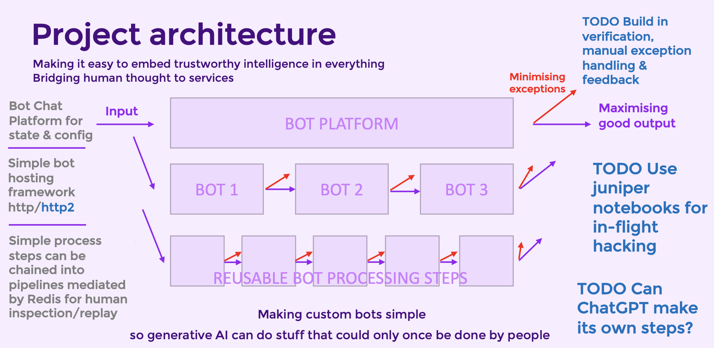

# ChatApp  #

Forked from https://github.com/narrowfail/django-channels-chat to play with the OpenAI GPT api.

It's a small person-to-person application built using Django where some users 
can be bots.  It has a REST API and uses WebSockets to notify clients of new 
messages and avoid polling.  Bots run in another container, and are notified 
via http.  They reply via the api.

https://github.com/lukerohde/gpt-chat/blob/master/docs/demo.mp4

# Setup

To avoid complex local dev config this has been setup using docker and docker-compose. Docker will need to be installed as a prerequiste.

For the bots to work, you'll need an openai api token.

Run `./setup` to;
* set your .env vars
* build your containers
* run you migrations 
* and setup your django root user.

This will ask if you want to setup your docker-compose.override.yml file.   Use this file to set up for your local environment.  

The docker-compose.override.yml.example is what I use for local mac development.  It maps the local files into the containers so you can 
do some programming.  It will also hang the containers so you can 
exec in and run commands.

Run `docker-compose up -d` to run the containers - or just `./go`

Shell in like `docker-compose exec app /bin/bash`

Once in the app container run `npm run server`

To run the bots, shell in like `docker-compose exec bot /bin/bash`

Once in, run `npm run bots`

See `Using docker-compose shortcuts` below

# Changes made in this fork

So far I've
- containerised it using docker-compose
- added deployment scripts for digital ocean
- got letencrypt working 
- got websockets working behind nginx (near killed me)
- switched to redis & postgresql
- upgraded to bootstrap 5 and given it a responsive face-lift
- dark mode! It's very dark
- used stimulusjs & parcel to organise my javascript
- switched to rendering server-side rather than API + JS
- bookmarkable RESTFUL urls
- created a bot server with configurable pipelines
- made a kids gratitude journal as a test pipeline
- broken all the tests and not fixed them!!!

It's quiet a bit more complex than narrowfail's beautifully simple app.


## Architecture ##



 - The default url is a chat between the current user and the first other user
 - Django renders the whole page client side to avoid JS api calls and rendering
 - The user posts to the server's chat view using a regular form
 - The bot posts to the server's message api and identifies itself with its token
 - When a message is received, the server notifies all clients via websockets
 - The server renders the message in html and sends it over the websocket for
   direct insertion into the dom.  No JS call to the API and JS rendering.
 - When the user is posting to a bot, the server also posts json the bot's 
   endpoint which is configured with the bot
 - The bot server runs in its own container listening on http://bot:8001
 - When the bot recieves a message it runs a pipeline of steps to compose a reply
 - Bot are customizable in yaml and composed of simple reusable py scripts
 - When a user selects another user/bot, it makes an ajax call for those messages
   and the server renders just those messages back in full html

## Assumptions ##
Because of time constraints this project lacks of:

- User Sign-In / Forgot Password
- User Selector Pagination
- Good Test Coverage
- Better Comments / Documentation Strings
- Frontend Tests
- failed to upgrade to django 4 - arrgghhh!!
- DONE Modern Frontend Framework (like React) - used stimulusjs ;)
- DONE Frontend Package (automatic lintin, building and minification) - used parcel
- DONE Proper UX / UI design (looks plain bootstrap) - pretty bootstrap


## Persisting data
This script mounts your pgdata and redis data on an external docker volume, so if you rebuild or remove your database or redis containers you don't loose all your data and don't have to reinstall all your packages.  

In the docker-compose.override.example I suggest persisting the data to local folders for inspection during local development.  I also persist the user volume for auto complete when inside your container

## Configuring/developing bots

DJANGO_SUPERUSER_TOKEN=xxx # run ./manage.py createsuperusertoken
The bot server uses DJANGO_SUPERUSER_TOKEN to register bots that are 
configured via yaml in app/bot_config.  


See bot_config/diaryfile.yaml and bot_config/japanese_bot.yaml for examples of how to make a bot.

Each step in these yaml files is a python class in the same directory.

You can make your own custom step class with a process method, that takes a payload parameter and returns the payload.  If you include
a payload['reply'] that will get posted to the user.

The pipeline approach is designed to make it simple to contribute reusable steps.   

## Deploying to Digital Ocean

To deploy to digital ocean you'll need doctl installed as a prerequisite.

On mac, `brew install doctl`

Then you'll need to config it with your digital ocean token. 

`doctl auth init`

In the deploy directory there are a number of scripts to help you get into production.  You run them from the parent directory.

* `deploy/go` will do everything
* `deploy/01-build-server` will make a digital ocean server and set `.digital_ocean_env` so your other scripts will work
* `deploy/02-config-server` this does everything to pave the road for deployment such as installing software and creating a non root user
* `deploy/03-deploy-repo` this will clone the repo in and copy up the env files mentioned below, then fire up docker compose 
* `deploy/userlogin` a shortcut for logging into the server
* `deploy/rootlogin` I should probably kill this
* `deploy/backup` take a copy of the production database
* `deploy/restore` restores the latest backup
* `deploy/cleanup` destroys the digital ocean server

If you are using the digital ocean deploy scripts in /deploy, there are two files you'll need;

* `.env-prod` for production configuration (same as .env unless you have different prod config)
* `.docker-compose-override.yml.prod` which open the app port


## Using docker-compose shortcuts
typing docker-compose all the time can be tedious so add this to your ~/.bashrc or ~/.bash_profile

Then 

`docker-compose stop && docker-compose up -d && docker-compose log -tf` 

becomes just

`dcs && dcu -d && dcl -tf`

but i have a shortcut for that too

`dcrestart`

The first alias `bp` makes editing and reloading your bash_profile easy.

The second command `get-python` makes getting this repo easy.

```
# shortcut for editing your bash profile and these shortcuts
alias bp='vim ~/.bash_profile && . ~/.bash_profile'
# Get this repo!
get-python() { git clone git@github.com:lukerohde/docker-python-template.git . ; rm -rf .git ; }
# docker shortcuts
alias ds='docker stats'
alias dc='docker-compose'
alias dce='docker-compose exec'
alias dcu='docker-compose up'
alias dcd='docker-compose down'
alias dcr='docker-compose run'
alias dcs='docker-compose stop'
alias dcb='docker-compose build'
alias dcps='docker-compose ps'
alias dcl='docker-compose logs'
alias dclf='docker-compose logs -f --tail=1000'
alias dckill='docker-compose kill'
alias dcrestart='docker-compose stop && docker-compose up -d && docker-compose logs -ft'
alias dps='docker ps'
alias dk='docker kill'
alias dkall='docker kill $(docker ps -q)'
alias drestart="osascript -e 'quit app \"Docker\"' && open -a Docker"
alias dstop='docker stop $(docker ps -aq)'
alias dprune='docker system prune -a'
dceb() { docker-compose exec $1 /bin/bash ; }
dcub() { docker-compose up -d $1 && docker-compose exec $1 /bin/bash ; }
dcudb() { docker-compose up -d db && docker-compose exec db psql -U postgres $1 ; }
ddeleteall() {
    docker stop $(docker ps -aq)
    docker system prune -a
}
```

## developing with docker on osx

Use the override file to mount your app volume with :delegated
```
cp docker-compose.override.yml.example docker-compose.override.yml
```

```
  app:
    volumes:
      - ./app:/app:delegated
```

The provided docker-compose.override.yaml.example file will not actually run your app.  Instead it runs docker-start.override that hangs the container to leave it running so you can shell in and run your application yourself.  This makes debugging easy.  

The shortcut for running your app then shelling in is
`dcub app` 

Once shelled in you can run `npm run server` etc...
